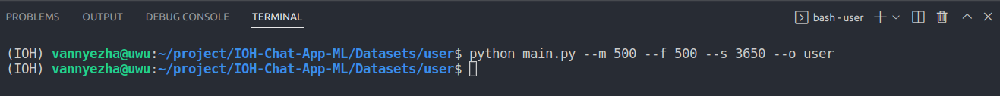

## User Dummy Data

 
 
<ul>
    <li>male = 500 orang
    <li>female 500 orang
    <li>max length male name = 3
    <li>max length female name = 3
    <li>seed = 3650
    <li>output name = user
</ul>
 
 
Data yang tercover dalam dataset ini adalah:
<ul>
    <li>name
    <li>username
    <li>email
    <li>phone_number
    <li>gender
    <li>born_date
    <li>born_place
    <li>nationality
    <li>address
        <ul>
            <li>street
            <li>rt
            <li>rw
            <li>village
            <li>subdistrict
            <li>district
            <li>province
        </ul>
    <li>ktp
    <ul>
            <li>nik
            <li>valid_till
            <li>card_create_date
            <li>card_create_place
            <li>religion
            <li>status
            <li>occupation
            <li>blood_type
        </ul>
</ul>

